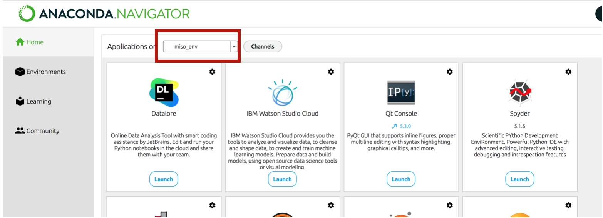

Setup
=====

It is possible to run the MISO2 code on any combination of IDE and Python environment you prefer. Below we provide
instructions on how to run the code using Conda and Spyder.

Requirements
~~~~~~~~~~~~

1. Clone the repository or download the MISO2 code
----------------------------------------------------------

Download the MISO2 code or create a local clone of the Github repository, for example by using the
`GitHub Desktop application <https://desktop.github.com>`_.

2. Create a conda environment
-----------------------------

Install either Anaconda Navigator, Conda or Miniconda. Two files in the root of the repository are of interest:

* **environment.yml** – Provides all relevant package names. You can use conda to create an environment for you from this file.
* **Readme.md** – Contains the minimum version numbers of the packages used during MISO2 development. Refer to this if you have compatibility issues.

The most simple way to setup an environment is from within the Anaconda Navigator in the “Environments” tab.
Navigate to the “environments.yml” and create the environment from the file. Activate it by clicking on the arrow next to it.
Then go your home screen and launch Spyder from the newly created environment.

.. image:: ../figures/conda_import_environment.jpeg
   :width: 700px
   :align: center

You can also install the environment via terminal::
 ``conda env create -f environment.yml``

After installation, activate the environment with::
 ``conda activate <environment-name>``

This will install all packages MISO2 requires.

3. Install MISO2
-----------------------------

To actually run the code, you will also need to install the MISO2 package itself. In the terminal, run ``pip install .``
in the base folder containing the `setup.py`. Add the ``-e`` flag for development mode, if you want to
interactively change code in the MISO2 package and have it reload automatically.

4. Open the project in an IDE of your choosing
------------------------------------------------

For example using Spyder with your environment from the Anaconda navigator.

Alternatively, you can use the terminal and activate the environment with ``conda activate <environment>`` and then starting ``spyder``.

Once Spyder is opened, create a new project, but choose to do so from an existing directory and your MISO2 folder.

.. image:: ../figures/spyder_import_project.jpeg
   :width: 400px
   :align: center

The code should now be ready to use.